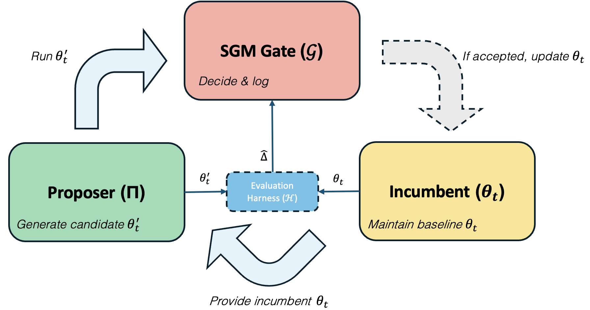

## Reference Implementation: Statistical Gödel Machine (SGM)
Anonymous Submission to ICLR 2025

This repository contains the reference implementation for the paper: "Anonymous (2025). Safe Gated Modification for Self-Improving AI," which introduces the Statistical Gödel Machine (SGM).

SGM establishes the first statistical safety layer for recursive self-modification in high-dimensional, stochastic AI systems. It replaces the unattainable formal proofs of improvement with statistical confidence tests, ensuring that irreversible edits are only accepted when superiority is certified at a chosen confidence level, while bounding the cumulative risk of adopting a harmful change across all rounds.

1. Setup and Dependencies
The code is implemented in Python and has been tested using the libraries listed in requirement.txt.

To set up your environment, follow these steps:

# Clone the anonymous repository
git clone [https://github.com/gravitywavelet/sgm-anon.git](https://github.com/gravitywavelet/sgm-anon.git)
cd sgm-anon

# Install the required Python packages
pip install -r requirement.txt

2. Reproducing Results
The experiments are organized into directories corresponding to the main claims and application domains discussed in the paper (Supervised Learning, Reinforcement Learning, and Black-Box Optimization).

Note: Where large datasets (e.g., CIFAR-100, ImageNet-100) are used, the corresponding scripts are designed to automatically download and process the data upon first run.

Directory

Core Experiment / Paper Claim

Reproduction Command (Example)

PGM_Ex4/

Certified Gain (SL): Demonstrates SGM certifying a genuine +5.5pp gain on CIFAR-100 under a 30-seed stress test.

python PGM_Ex4/run_cifar100_certified_gain.py --mode SGM --seeds 30

PGM_Ex5/

Principled Rejection (SL): Demonstrates SGM correctly rejecting a seemingly promising edit on ImageNet-100 that failed the statistical confirmation test.

python PGM_Ex5/run_imagenet100_rejection.py --alpha 0.05

PGM_Ex6/

CTHS Implementation (Optimization): Code for the black-box optimization benchmark and the implementation of Confirm-Triggered Harmonic Spending (CTHS).

python PGM_Ex6/run_optimization_cths.py --budget 0.01

SSL/

Reinforcement Learning (RL): Implementation of SGM in a stochastic RL environment, showcasing robustness and risk-aware self-modification.

python SSL/run_rl_benchmark.py --env LunarLander

We recommend running the scripts within PGM_Ex4/ and PGM_Ex5/ first, as they directly validate SGM's core gate mechanism—certifying true gains and rejecting spurious ones.

3. Contact
For technical questions regarding the implementation, please open a GitHub Issue in this repo