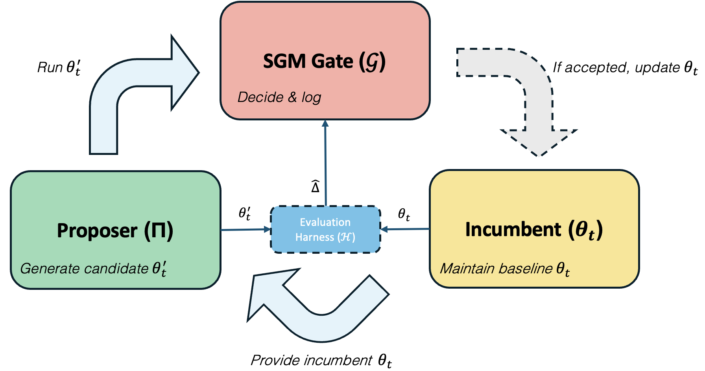

## Reference Implementation: Statistical Gödel Machine (SGM)

Anonymous Submission to NeurIPS 2026

This repository contains the reference implementation for the paper: "Anonymous (2026). Statistical Gödel Machines: Safe Self-Evolution under Irreversible Updates," which introduces the Statistical Gödel Machine (SGM).

SGM establishes a statistical safety layer for recursive self-modification in high-dimensional, stochastic AI systems. It replaces the unattainable formal proofs of improvement with statistical confidence tests, ensuring that irreversible edits are only accepted when superiority is certified at a chosen confidence level, while bounding the cumulative risk of adopting a harmful change across all rounds. A key component, **Confirm-Triggered Harmonic Spending (CTHS)**, concentrates statistical power on confirmation events while preserving strict global safety guarantees.



> **Core insight:** Reliable self-improvement is not an optimization problem, but a long-horizon decision problem under irreversibility, requiring explicit control of cumulative risk.

# 1. Setup and Dependencies

The code is implemented in Python and has been tested using the libraries listed in `requirement.txt`.

To set up your environment, follow these steps:

## Clone the repository

```bash
git clone https://github.com/gravitywavelet/sgm-anon.git
cd sgm-anon
```

## Install the required Python packages

```bash
pip install -r requirement.txt
```

# 2. Reproducing Results

The experiments are organized into directories corresponding to the main claims and application domains discussed in the paper (Supervised Learning, Reinforcement Learning, Black-Box Optimization, and Long-Horizon Self-Modification).

Note: Where large datasets (e.g., CIFAR-100, ImageNet-100) are used, the corresponding scripts are designed to automatically download and process the data upon first run.

| Directory | Core Experiment / Paper Claim | Reproduction Command (Example) |
|-----------|-------------------------------|-------------------------------|
| `PGM_Ex4/` | **Certified Gain (SL):** Demonstrates SGM certifying a genuine +5.51pp gain on CIFAR-100 under a 30-seed stress test. Only iteration 6 (`weight_decay=0.001, ema_decay=0.99`) survives confirmation with LCB = +0.31. | `python PGM_Ex4/run_cifar100_certified_gain.py --mode SGM --seeds 30` |
| `PGM_Ex5/` | **Principled Rejection (SL):** Demonstrates SGM correctly rejecting a seemingly promising edit on ImageNet-100 that failed the statistical confirmation test, revealing a clear safety–power trade-off. | `python PGM_Ex5/run_imagenet100_rejection.py --alpha 0.05` |
| `PGM_Ex6/` | **CTHS Implementation (Optimization):** Code for the black-box optimization benchmark and the implementation of Confirm-Triggered Harmonic Spending (CTHS), which detects improvement at iteration 6 while harmonic and uniform schedules fail due to budget dilution. | `python PGM_Ex6/run_optimization_cths.py --budget 0.01` |
| `SSL/` | **Reinforcement Learning (RL):** Implementation of SGM in stochastic RL environments (CartPole-v1, LunarLander-v2, Rastrigin-20), showcasing robustness and risk-aware self-modification. | `python SSL/run_rl_benchmark.py --env LunarLander` |
| `PGM_Ex7/` | **Long-Horizon Recursive Self-Modification (§4.3):** SGM evaluated over 40 sequential proposal iterations on ImageNet-100, demonstrating stable near-monotonic improvement (23.2% → 28.2%) with only ~16% the compute of naive full confirmation (~2136 vs ~12960 minutes). Two acceptances across 40 iterations; cumulative risk remains below global budget δ = 0.1 across all 120 decisions. | `python PGM_Ex7/run_imagenet100_longhorizon.py --iters 40` |

We recommend running the scripts within `PGM_Ex4/` and `PGM_Ex5/` first, as they directly validate SGM's core gate mechanism — certifying true gains and rejecting spurious ones. For the full long-horizon evaluation, see `PGM_Ex7/`.

## Key Results Summary

- **CIFAR-100 (PGM_Ex4):** SGM accepts exactly one configuration across 10 iterations, achieving a certified +5.51pp gain. CTHS enables early detection at confirmation round 1, while harmonic allocation fails to accept under the same budget.
- **ImageNet-100 (PGM_Ex5/PGM_Ex6):** Across 3 independent runs, SGM consistently identifies the same stable improvement at iteration 6 (normalized improvement μ = 0.989 ± 0.002, LCB > 0.97), rejecting all other candidates.
- **Long-Horizon (PGM_Ex7):** Over 40 iterations, SGM maintains stable, near-monotonic performance improvement with sparse accepted updates. The two-stage protocol requires only ~16% of the compute of naive full confirmation while retaining statistical reliability.
- **Risk Ablation (§4.4):** Only CTHS detects the true improvement; harmonic and uniform schedules fail due to budget dilution, confirming that risk allocation is a structural component of safe self-modification, not a tuning detail.

# 3. Contact

For technical questions regarding the implementation, please open a GitHub Issue in this repo.